## 简介

小熊猫编译器（RedPanda-CPP）是轻量级的 C/C++ IDE 。它集成了GNU的GCC、G++编译器以及GDB调试器。它以简洁的用户界面、多平台支持（Windows、Mac OS、Linux）和高效的代码编辑功能为特点，适合编程初学者和教育用途。

小熊猫编译器提供了代码自动补全、语法高亮、代码导航等辅助工具，允许用户根据项目需求配置编译选项。

## 下载

### 官网下载

[小熊猫官网](http://royqh.net/redpandacpp/download/)

打开官网，点击下载页面
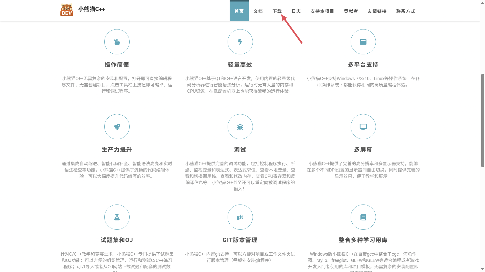

点击第一个蓝奏云网盘下载
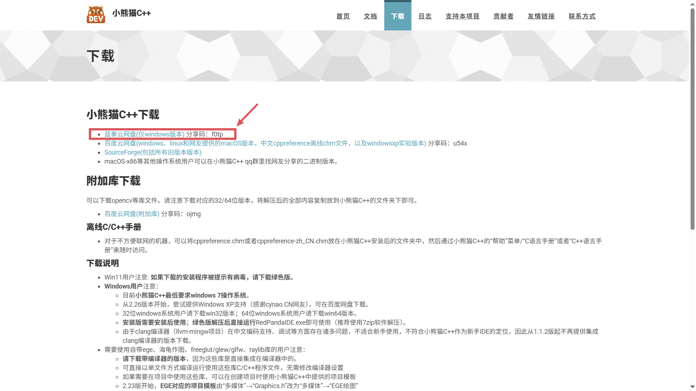

<Callout type="info" title="下载">蓝奏云下载方式请注意下载下图中所指示的版本</Callout>

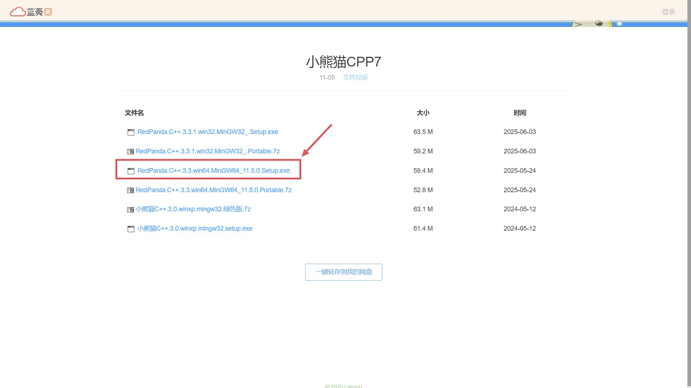

输入提取码：`f0tp`
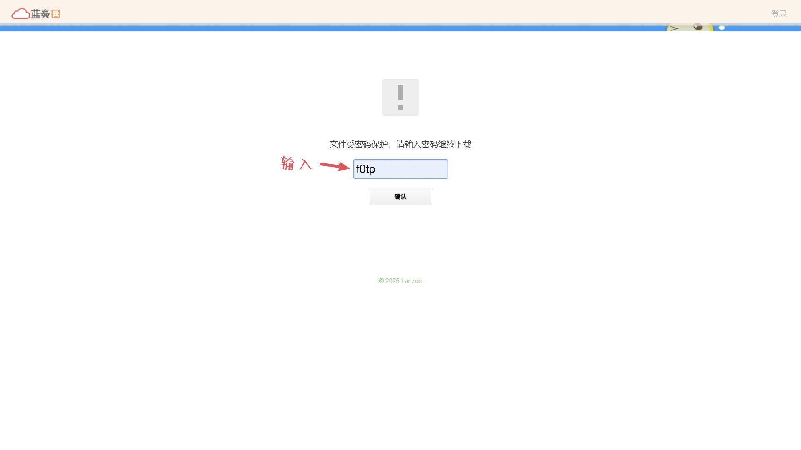

任点一个进行下载
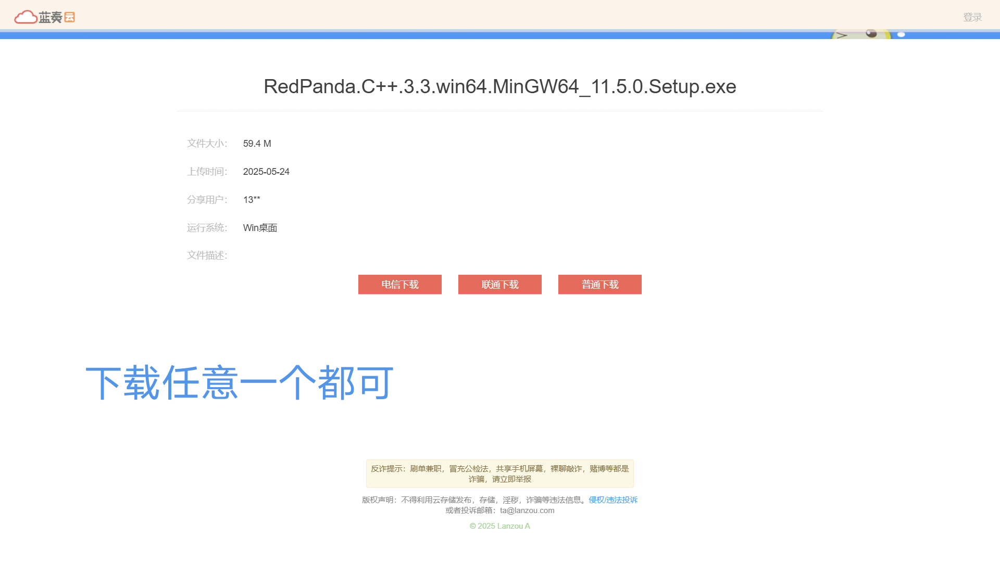

下载完成后有时会出现风险问题（点击该文件右上角三个点）
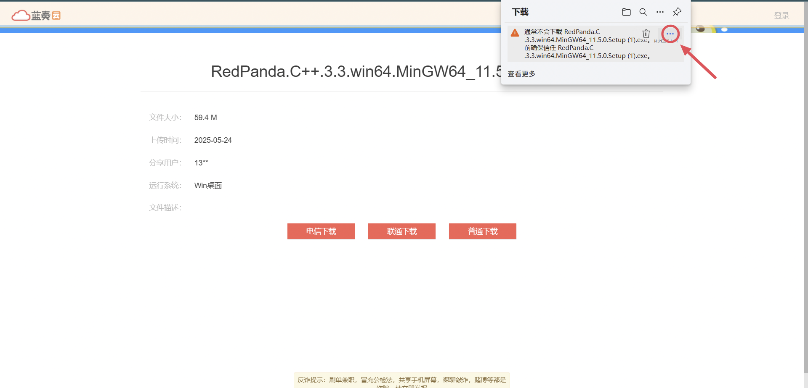

接着点击保留
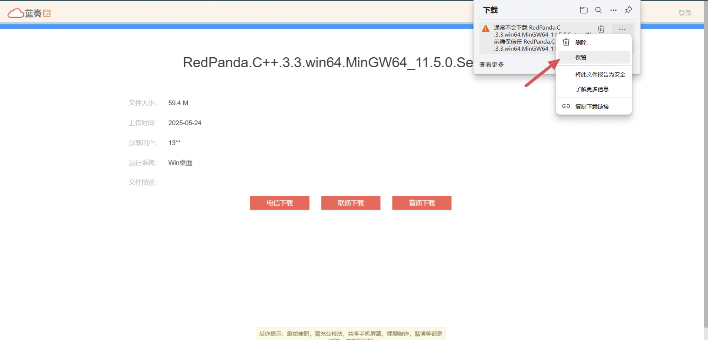

然后会出现弹窗，找到仍然保留即可正常打开文件
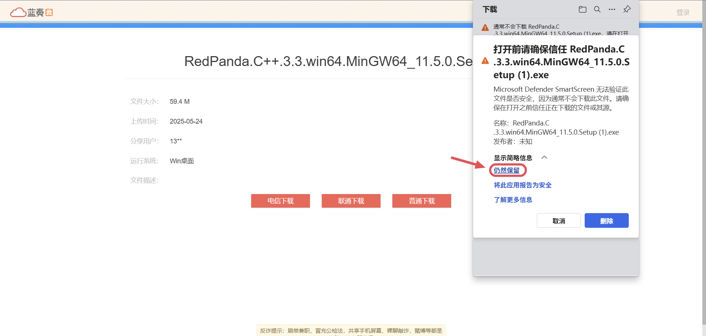

### 本站下载

[点击此处下载](/download)

## 安装

打开下载好的安装程序，等待加载完成，之后选择`简体中文`，并点击`OK`
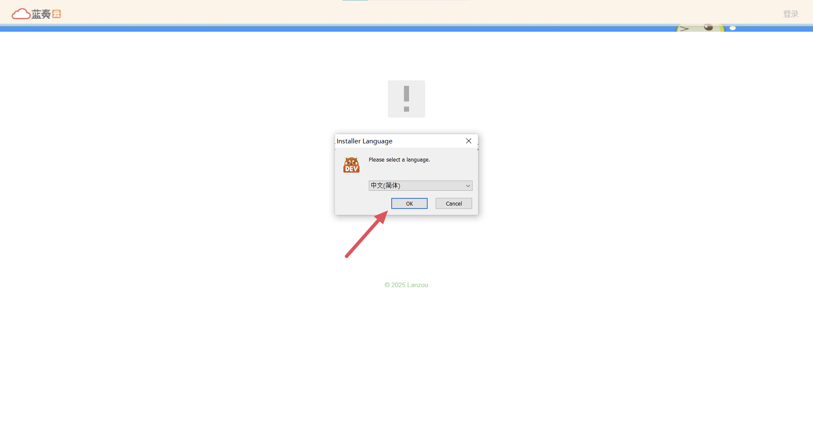

用户协议选择 `我接受`


安装的用户选择 `只为我自己安装`


`选择组件`一般默认就行
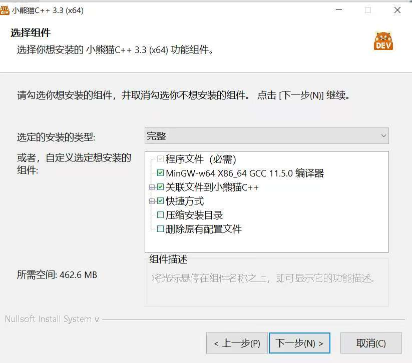

接下来的`安装路径`自己选择即可，没有的话默认也可以
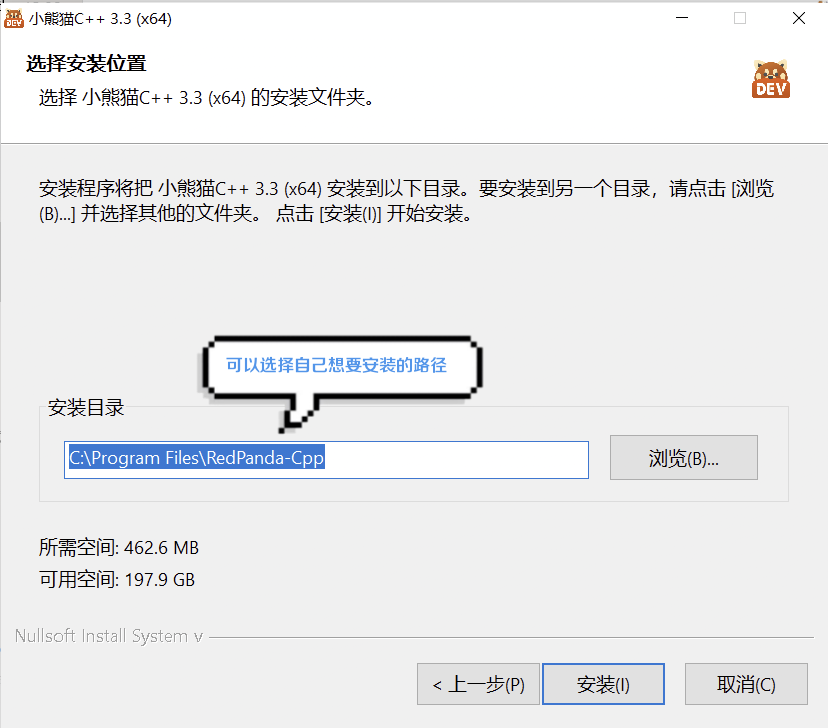

等待`正在安装`中
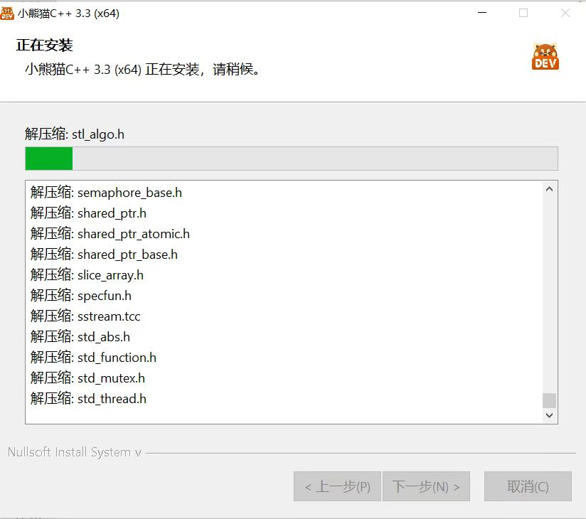

点击`完成`即安装结束

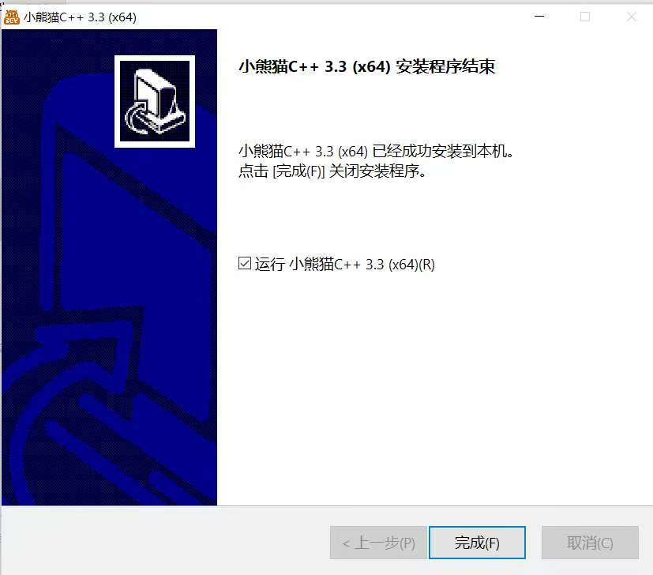

点击 `yes` 后开始设置`主题`，`语言`（按照需求安装）


至此，我们的安装步骤完成


## 使用

### 创建项目

首先点击 `文件`


选择 `新建` 然后点击 `创建新的C/C++文件` (也可以先创建一个项目然后在项目里创建C/C++文件)。

项目相当于一个文件夹，如果有很多相同性质的C/C++文件可以放在一个项目里。

<Callout title="Tips">
但多说一句，项目的实际作用不止于此：它是一个完整的工程，里面会有多个完成特定功能的模块。感兴趣的同学可以在空余时间了解一下：在编程领域中，什么是项目。
</Callout>

这里用创建项目做演示：点击OK后会提示不存在该项目（如果存在说明重名了）


随后创建项目文件


### 运行代码

现在就可以编写第一个程序了


这是源代码

```c lineNumbers title="example.c" title="example.c"
#include<stdio.h>
int main(){
	int a,b;
	scanf("%d,%d",&a,&b);
	printf("两数之和为%d",a+b);
	return 0;
}
```

运行结果


## 配置

在顶部菜单栏中，选择 `工具` - `选项`，找到窗口左侧列表中的外观


字体、背景、语法高亮等常见外观都可以在这里调整。

<Callout title="Tips">
用到这里是不是感觉 小熊猫 C++ 和 Dev-C++ 很相似呢？其实这两者之间有很大的联系。你可以简单地理解为：小熊猫 C++ 是在 Dev-C++ 停止更新后的接替品。
</Callout>
