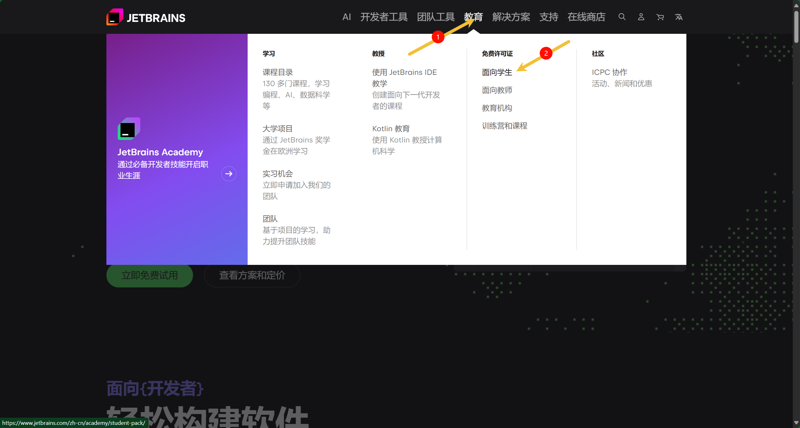
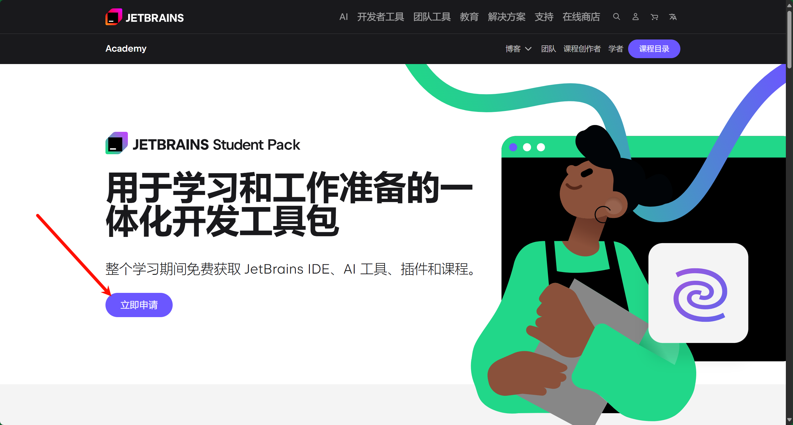
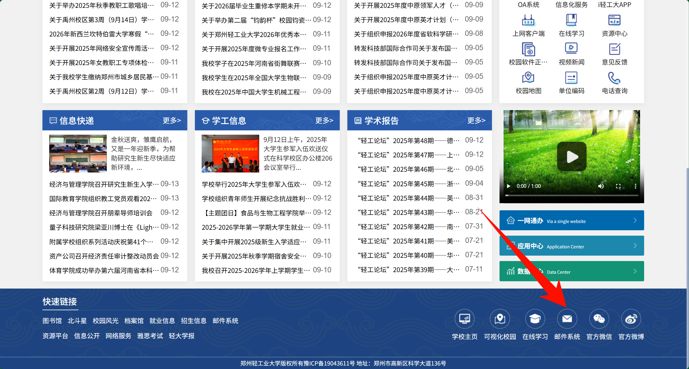
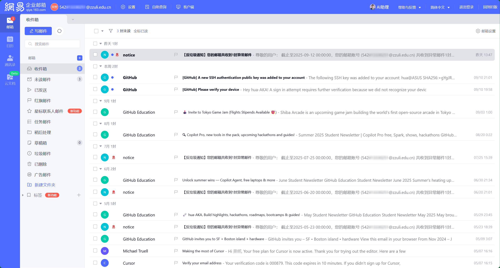
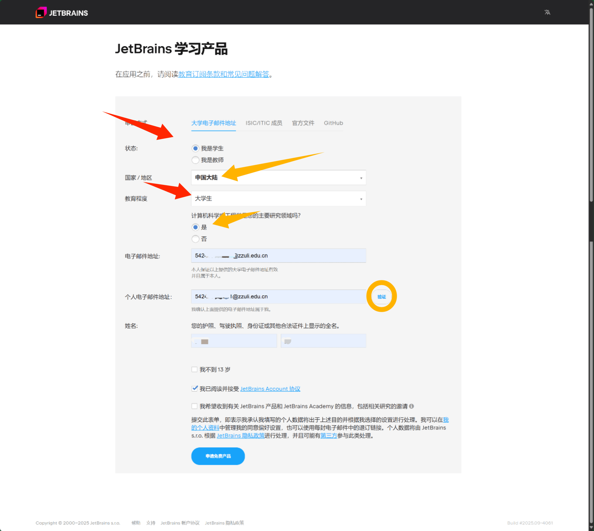
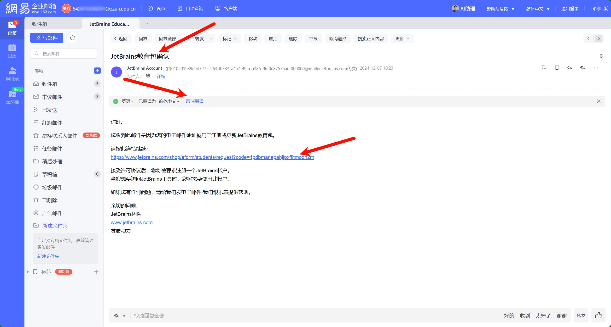
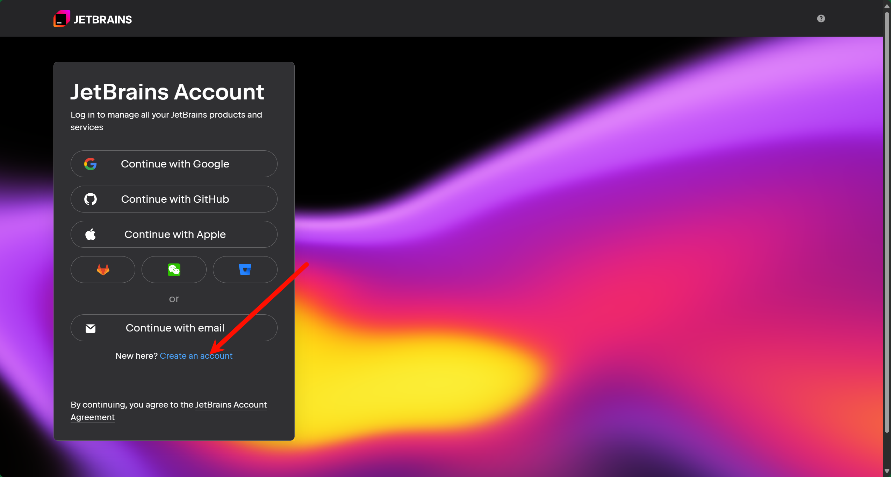
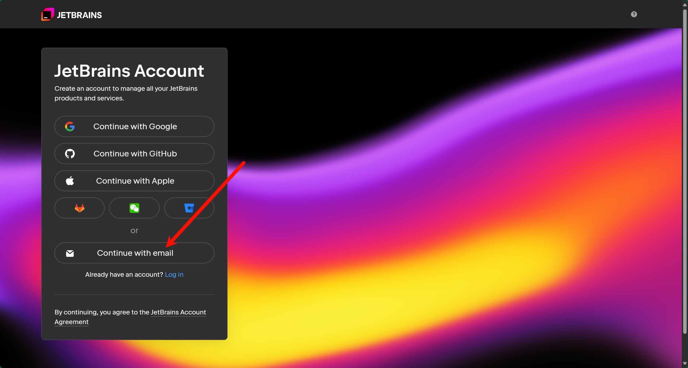
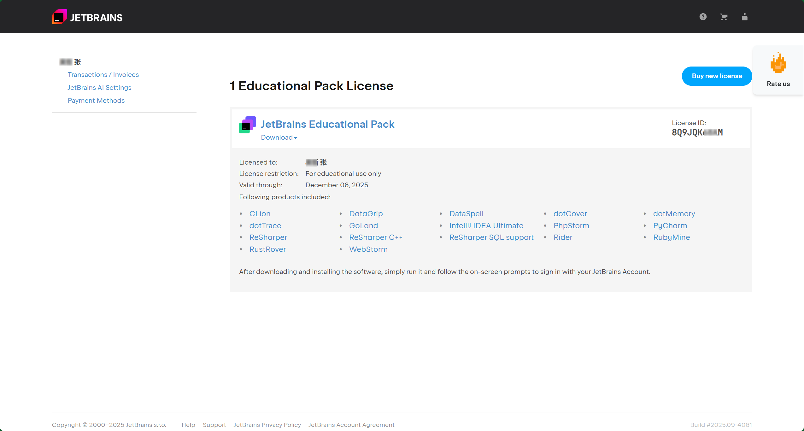

## 前言
针对计算机专业大学生和教育工作者，JetBrains的教育许可证
满足整个学习期间免费获取 JetBrains IDE、AI 工具、插件和课程。
其十分方便高效，现在我们来申请并使用。
## 申请许可证
首先我们前往[JetBrains官网](https://www.jetbrains.com/zh-cn/ "JetBrains官网，点击跳转")
，点击教育，面对学生。

**点击立即申请**

## 教育邮箱
我们进入[郑州轻工业大学智慧门户](https://portal.zzuli.edu.cn/#/home)
页面划至底部，**点击邮件系统**

进入邮件系统，左上角即为个人教育邮箱，学号+@zzuli.edu.cn

## 填写申请表
如表所示，选项如图填写，邮箱我们选择教育邮箱，注意人机验证。

完成后，我们回到邮件系统，会收到这样一封邮件，我们点击一键翻译，英文好的同学不必。点击链接，我们继续下一步。

我们选择创建新用户

使用邮箱创建，我们选择教育邮箱，密码自行设置。

用户创建成功后再次登录，许可证申请完成，**时间为期一年**，到期后相同操作再次即可。

## 结语
至此JetBrains教育认证已完成，全家桶皆可免费使用，选择使用的软件下载即可。