## 简介
PyCharm 是JetBrains公司研发，用于开发 Python 的 IDE 开发工具。其带有一整套可以帮助用户在使用 Python 语言开发时提高其效率的工具，比如调试、语法高亮、项目管理、代码跳转、智能提示、自动完成、单元测试、版本控制。此外，该 IDE 提供了一些高级功能，以用于支持 Django 框架下的专业 Web 开发。

## 下载
PyCharm 分为**社区版**、**专业版**。作为初学者或者普通用户，使用免费的社区版就可以满足我们大部分的开发需求了。**目前官方的最新版本为 2025**。作为初学者或者普通用户，使用免费的社区版就可以满足我们大部分的开发需求了。

## 官网下载

### 配置编译器
进入 [python官网](https://www.python.org/) 配置python编译器

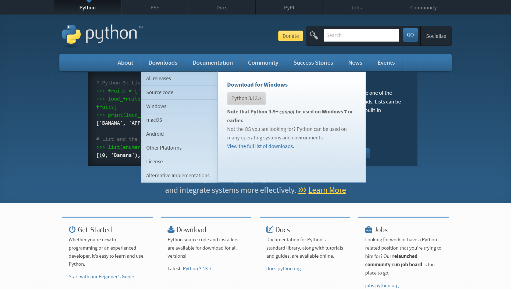

点击对应操作系统的版本下载（点击灰色框就会直接下载了）

<Callout title="Tips">如果有最新版本下最新的，我这里是Python3.13.7。</Callout>

下好了之后可以进终端（cmd）检验一下，输入python，出现对应版本即下载完成。

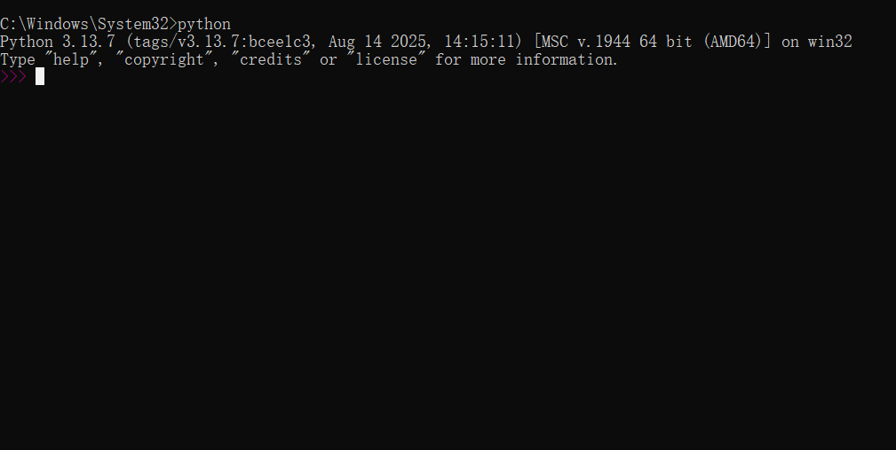

## PyCharm下载

<Callout title="Tips">在校学生可以申请免费使用专业版的（JETBRAINS旗下的一套都可以使用，列如IDEA）这里以社区版为例</Callout>

打开[官网](https://www.jetbrains.com/zh-cn/pycharm/)点击Pycharm下载<br/>

如果进的是jetbrains官网，找到开发者工具，里面有pyCharm下载


点击下载，找到其他版本

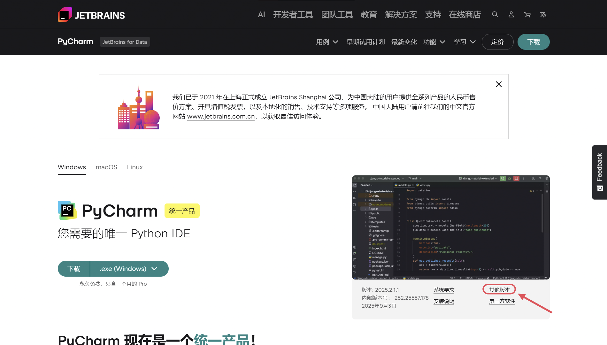

选择适配于电脑的版本，我这里是Windows（exe），你可能会好奇还有个基于 ARM64 架构的版本，这个可以自己去了解，我只说怎么看自己电脑是不是 ARM64 架构的：在设置中查看电脑信息，找到系统类型（如果是基于 x64 的处理器就是基于 X86_64 架构下普通的就好；如果基于 ARM64 的就下 ARM64 版本）

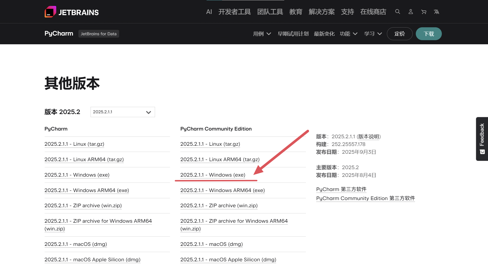

### 安装
等待下载完成，打开文件,点击下一步，安装路径可以选择自己想要安装的，一般默认就好

<Callout title="Tips">下面这一步建议都勾选上，方便后续使用</Callout>

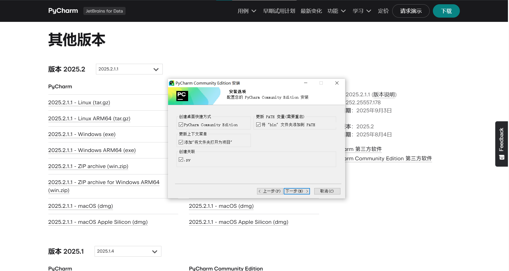

等待安装完成


你就成功的下好了PyCharm

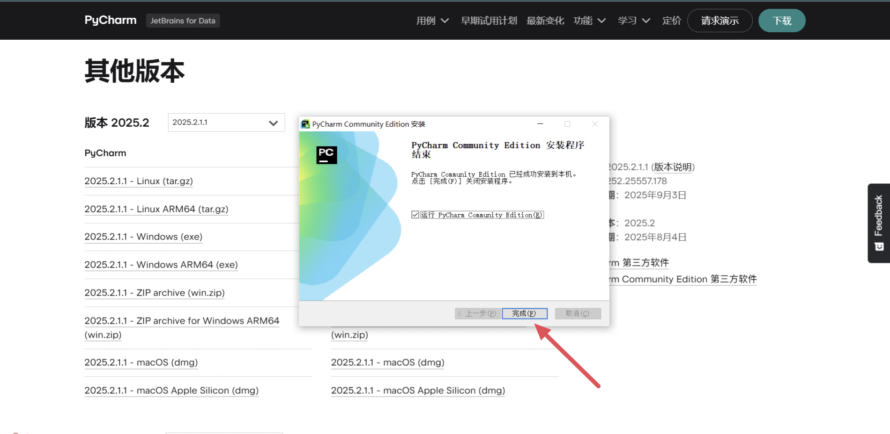

## 运行 
打开PyCharm，这一步选择跳过导入

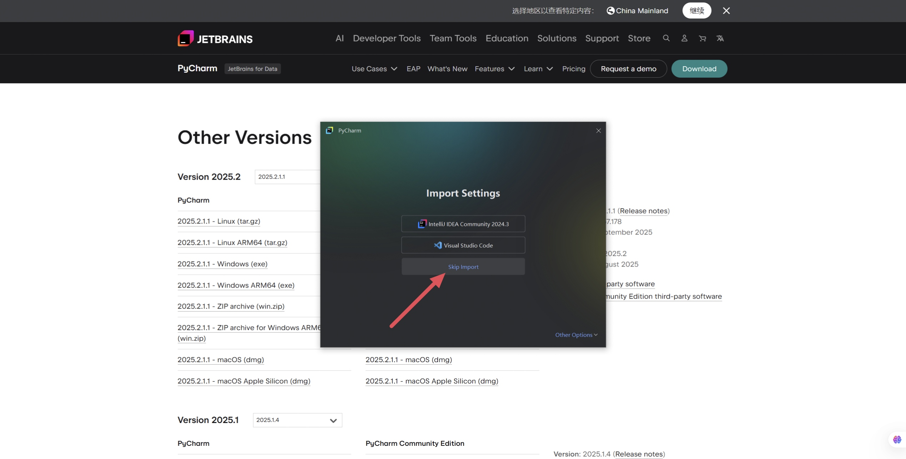

进入PyCharm,你就真正迈进python编程的大门了


先点击New project进入到这个页面


找到右上角的设置，点击settings

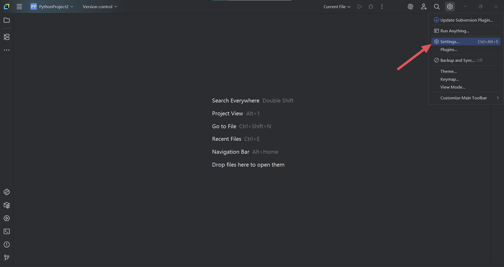

就可以设置你喜欢的主题，字体等个性化元素

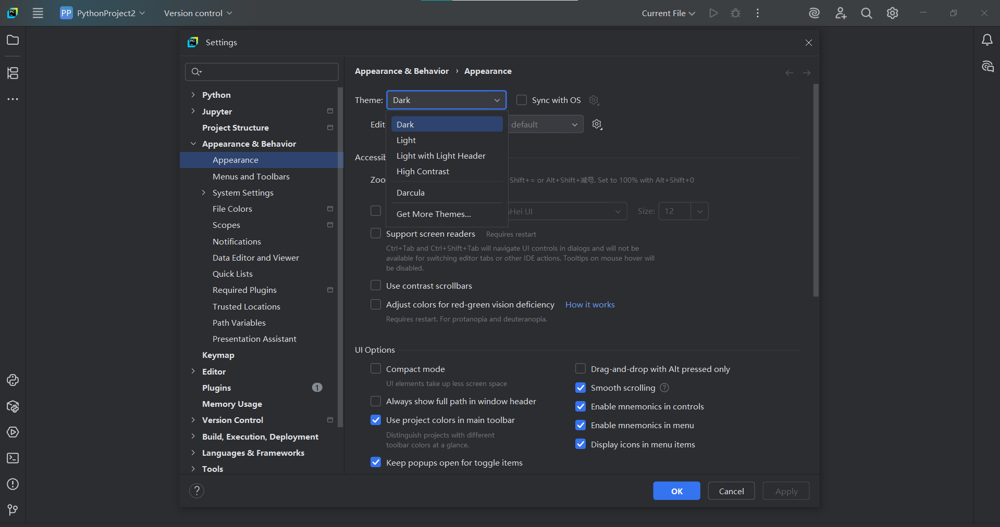

### 汉化
这只是为了方便一些英文不好的同学，我们还是建议全英使用（方便后续学习）

（如果是 24.1 版本之前的需要下载中文包）在 `setting` 中找到 `Plugins`,接着输入 `Chinese`，下载中文语言包，然后点击 `Apply`，应该会让你重启一下 PyCharm，然后就调成中文模式了

24 版之后的可以直接在 `setting` 中找到 `System setting`，找到 `Language and Region`，就可以切换成中文了


### 新建项目
准备创建项目文件，找到左上角的File，点击New Project


创建项目文件时，你也能二次检查你的编译器是否下好，（我的version是3.13版本，如果什么版本也没有，就是没配置成功，建议返回去查看哪些步骤出错了）你可以设置这个文件的目录，名字，点击创建

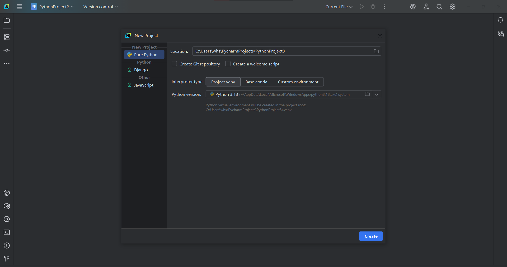

就创建好了文件

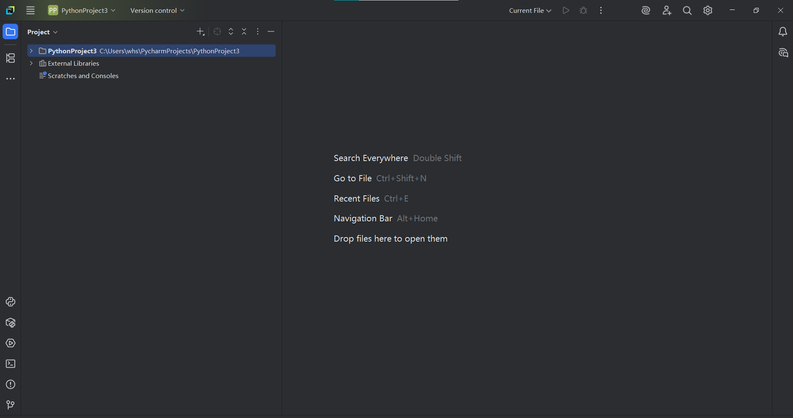

要想运行个 python 程序，右键点击这个项目，new，接着点击 python file

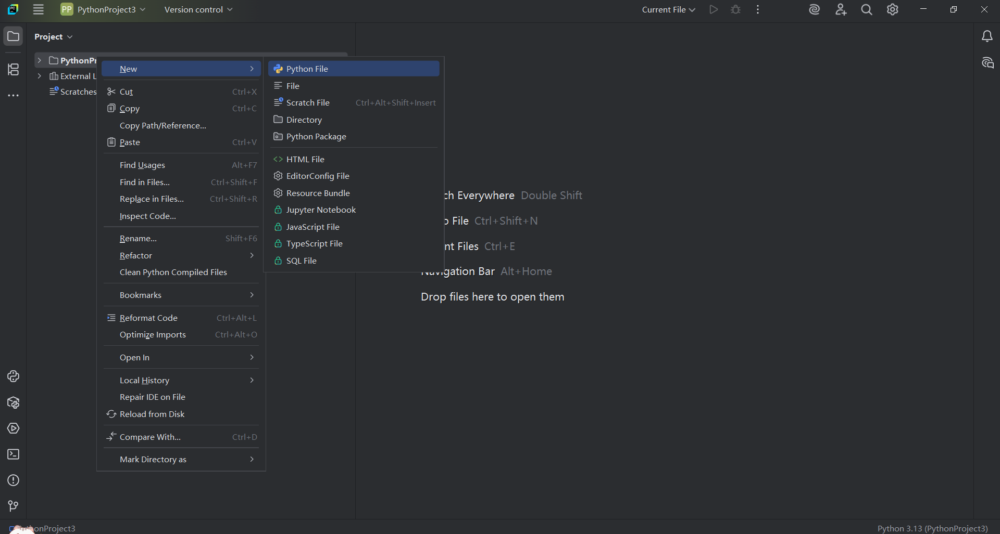

给这个程序起个名字，接下来可以编写程序了（我以 text 为例）

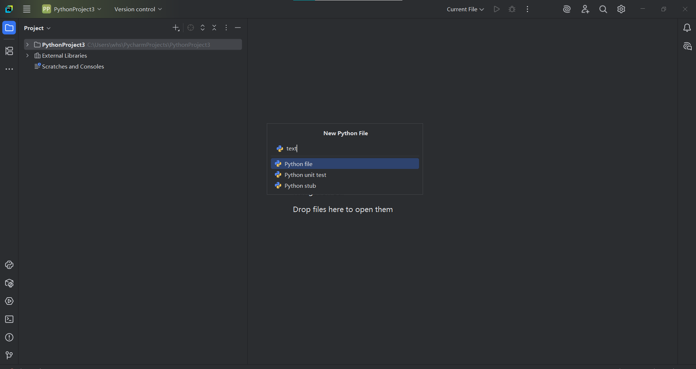

## 运行代码

这是源代码，可以把这个复制到程序中（以九九乘法表为例）

```python lineNumbers title="example.py"
print("Hello World!!")

for x in range(1,10):
    for y in range(1, x+1):
        print(f"{y}*{x}={y*x}", end = '\t')
    print()
```

点击绿色小三角，为运行，运行结果如下

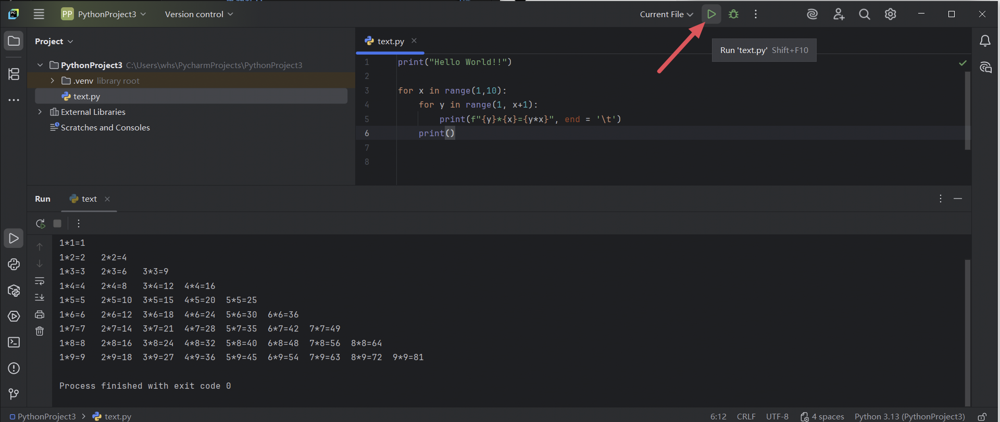

至此，你的 PyCharm 就可以正常工作了